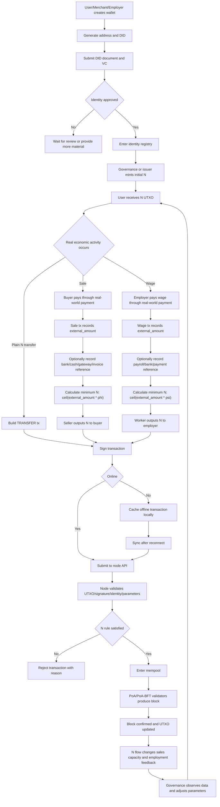

# BCS Reverse N-Money System

### 1. Purpose of the Project

Many people today face unemployment, shrinking job opportunities, and age discrimination. In some places, people over 35 can find it extremely difficult to obtain stable work. Some have suggested that consumers should stop buying products from companies that refuse to hire older workers, but that idea is hard to operate in practice. Ordinary consumers cannot reliably connect every purchase to a company's employment responsibility. This project uses N-money to abstract that relationship into a monetary rule: instead of forcing a direct employment promise between a consumer and a company, the system adds a "being-needed" settlement dimension to money, so that consumption, sales, employment, and N flows can form a verifiable economic feedback loop.

This project is not designed to make people rich overnight, nor to add another burden to ordinary people. It uses blockchain and digital-currency technology, but it has nothing to do with mining, hash-power competition, or speculative token hype. Its purpose is economic balance. Money is a tool for allocating social resources, and the current one-directional D-money system is gradually exposing a structural weakness: it represents demand and purchasing power, but it does not directly represent whether people are still needed by the economy. N-money is proposed as a reverse monetary tool to help correct that imbalance, reduce the risk of people being eliminated by market forces, and provide a new mechanism for preventing economic crises.

The current project is only a very early beginning. It is not a final answer. It is a prototype that can run, be discussed, be challenged, and be improved. Just as early Bitcoin began as a small experiment and later changed how many people think about money and network cooperation, BCS and N-money need more people to join and help turn this idea into working code, rules, governance, applications, and social understanding.

---

### 2. Source of the Idea

The theoretical source of this project is the a Bidirectional Currency System, or BCS from me.

In early barter exchange, one exchange usually satisfied two directions at the same time. You needed what another person had, so your demand was satisfied. The other person accepted what you had, so you were also needed. Demand and being demanded appeared together in the same act of exchange. Barter was inefficient because it required a double coincidence of wants, but it preserved a direct form of reciprocity.

Money solved the double-coincidence problem and greatly improved exchange efficiency. People could sell labor or goods, receive money, and then use money to buy other goods. Money made specialization, saving, pricing, markets, and long-term contracts possible. It was one of humanity's most important institutional inventions.

However, money also introduced a structural separation. When a buyer pays money, the buyer's consumption need is satisfied, but the buyer's own being-needed status is not automatically validated in the same transaction. In modern economies, being needed is mostly expressed through employment, wages, orders, positions, and income. When jobs are abundant, this problem is less visible. But as industrialization, automation, platformization, and capital concentration advance, more people may lose income, bargaining power, and stable employment. The being-needed side gradually disappears from the monetary settlement process.

The core weakness of the current one-directional D-money system is not that it has no value. Its weakness is that it expresses demand and purchasing power very well, but does not directly express being needed. In early industrial phases, when goods were scarce and labor demand was strong, this weakness was less obvious. As productive capacity grows, goods become abundant, and automation becomes stronger, the weakness becomes more serious. Society can produce more and more, while many people lose the income needed to participate in consumption. Firms may continue reducing labor costs, further weakening aggregate demand.

BCS starts from this missing direction. D still represents ordinary money, prices, and payments. N represents the being-needed settlement asset. Sales and wage payments are no longer only one-directional flows of D; they also trigger reverse flows of N. The market is not abolished. It is given a new feedback dimension.

---

### 3. What This Project Is and Is Not

This project is a technical prototype for reverse N-money. It uses blockchain, UTXO, identity authentication, governance, multi-node synchronization, offline transactions, and optional privacy proofs to test whether BCS monetary rules can be implemented in software.

It is not a normal public-chain project. It does not pursue open mining, does not rely on Proof-of-Work competition, does not encourage speculation, and does not treat token price appreciation as the main goal. The key goal is not to create another speculative asset, but to build a settlement system that can express both demand and being-needed relations.

It is not a direct replacement for real-world money. At the current stage, cash, banks, payment gateways, invoices, and payroll systems continue to operate as they already do. The project mainly processes N-money on-chain. D is not forced to become an on-chain asset. The system does not force bank or payment-gateway integration. It uses `external_amount` to represent the external real-world amount used to calculate N flows. External payment references can be optionally stored, and later the system may choose to integrate banks, payment gateways, invoice systems, payroll systems, or on-chain D assets.

It is also not a system that magically guarantees jobs for everyone. N-money cannot create jobs out of nothing and cannot replace real business operations. Its goal is to make relationships such as who creates employment, who provides being-needed opportunities, and who consumes social demand computable, auditable, and governable through monetary flow.

---

### 4. Core Concepts

#### 4.1 D: Demand Money

D can be understood as ordinary real-world money or a normal payment amount. It may come from cash, bank transfers, cards, mobile payments, Stripe, invoices, payroll records, or other real-world payment systems.

In the current project, D is not forcibly issued as an on-chain asset. The system does not custody users' real-world funds, does not handle fiat deposits or withdrawals, does not perform bank clearing, and does not force payment-gateway integration. The chain only needs an external amount, `external_amount`, which is used to calculate the corresponding N flow.

#### 4.2 N: Being-Needed Money

N is the on-chain currency processed by this project. It represents the being-needed dimension in economic relationships. N can be issued, transferred, burned, replenished, and audited.

In a sale, after a seller receives a real-world payment, the seller must transfer a proportional amount of N to the buyer. This expresses that the seller receives income from consumer demand and must release part of its being-needed capacity to the consumer.

In a wage transaction, after an employer pays wages in the real world, the worker transfers a proportional amount of N to the employer. This expresses that the employer provided a job opportunity that helped the worker obtain real-world income, and therefore receives N that can support future sales capacity.

#### 4.3 phi and psi

`phi` is the sales-rule parameter. It determines how much N must be rebated to a buyer for a given external sale amount.

```text
N_to_buyer >= ceil(external_amount * phi)
```

`psi` is the wage-rule parameter. It determines how much N must be transferred to an employer for a given external wage amount.

```text
N_to_employer >= ceil(external_amount * psi)
```

These parameters should not be arbitrary or permanently fixed. They should be governed by the system and adjusted according to pilot data, employment conditions, N circulation, merchant pressure, user acceptance, and economic-stability goals.

#### 4.4 Identity

The system needs to know who is a user, merchant, employer, validator, and governor. The current design uses DID and VC. A user generates a DID, receives a VC from a trusted anchor or governance-approved institution, and submits an on-chain registration. After authentication, the user can participate in key flows such as receiving initial N, joining governance, or performing privileged transactions.

#### 4.5 Governance

In the early stage, the system should be governed by founders and partners through joint voting. This allows fast iteration, prevents early abuse, and makes it possible to fix system problems quickly. As the network matures, governance should gradually be transferred to the entire system, allowing users, nodes, merchants, employers, and other participants to vote through transparent rules.

Governance is not only voting. Governance decides parameters, trusted anchors, identity policies, N issuance rules, replenishment rules, validator sets, upgrade plans, and risk responses.

---

### 5. Overall Operating Flow



---

### 6. Explanation of the Flow

#### 6.1 Entering the System

When a user first enters the system, they do not mine and do not buy a speculative token first. They create a wallet, generate keys, and generate a DID. The DID is the user's decentralized identity in the system. Then the user receives a VC from a trusted anchor or governance-approved institution, proving that the user is a legitimate participant.

When a node receives an identity registration request, it verifies DID control, VC signature, trusted issuer status, credential expiration, and governance rules. After approval, the identity enters the registry. Identity state affects N issuance, transaction permissions, and governance eligibility.

#### 6.2 Initial N Issuance

N is not mined. In the early stage, governance or an issuance module can mint initial N according to identity authentication results. The issuance rule should be transparent. For example, each authenticated user may receive a certain initial amount of N, or different pilot roles may receive different amounts.

The key requirements are fairness and auditability. The system should record who received N, at which height, how much, which governance signatures approved it, and whether supply limits were respected.

#### 6.3 Plain N Transfers

A plain N transfer is similar to a normal digital-currency transfer. The user selects UTXOs, fills in recipient and amount, signs the transaction, and submits it to a node. The node verifies input existence, no double spend, valid signatures, and reasonable outputs. If valid, the transaction enters the mempool and waits for block confirmation.

Plain N transfers do not involve external amounts, `phi`, or `psi`.

#### 6.4 Sales Transactions

Sales transactions are one of the most important flows. In the real world, the buyer may pay the merchant through cash, bank transfer, mobile payment, card, payment gateway, or another payment method. The chain does not forcibly process that real-world payment and does not require payment-gateway integration.

The on-chain sale transaction must at least record `external_amount`, the calculation base for the real-world sale amount. The merchant may optionally attach an order number, invoice hash, bank receipt, payment-gateway order id, or another reference.

When validating a sale transaction, the node reads the current `phi` and calculates the minimum N rebate. If the N output to the buyer is insufficient, the transaction is rejected. If sufficient, it can enter the mempool and wait for confirmation.

The meaning of the sales rule is that merchants cannot only receive D income from social demand; they must also release part of their N. The larger the merchant's sales scale, the greater its need for N. N therefore becomes an economic constraint that limits unlimited expansion and reconnects consumption with employment.

#### 6.5 Wage Transactions

Wage transactions are the other key loop. In the real world, the employer pays wages through cash, bank transfer, payroll, or another payment system. The chain does not forcibly process the wage payment itself and does not require payroll records to be stored.

The on-chain wage transaction must at least record `external_amount`, the wage amount used as the calculation base. The worker transfers a proportional amount of N to the employer, determined by `psi`. Payroll records, bank receipts, and payment proofs can be optional references.

The meaning of the wage rule is that employers who provide job opportunities can receive N, and N supports future sales capacity. Employment is not only a cost to the firm; it also becomes a way to acquire N. The system tries to make providing work an important condition for long-term business expansion.

#### 6.6 Offline Transactions

The project includes offline-payment capability. When a user is temporarily offline, the wallet can build a transaction from the latest local UTXO snapshot, sign it locally, and cache it. After reconnecting, the wallet submits the transaction to a node.

Offline transactions may encounter conflicts. For example, the same UTXO may already have been spent by another transaction, or `phi` and `psi` may have changed while the user was offline. The system must detect conflicts, try to rebuild transactions, recalculate N, ask the user to sign again, or reject clearly.

Offline capability matters because real-world payments do not always happen under stable network conditions. A monetary system for ordinary people cannot assume perfect connectivity.

#### 6.7 Node Validation and Block Production

After receiving a transaction, a node performs several layers of validation. First, transaction structure: version, inputs, outputs, amounts, and serialization. Second, UTXO and signatures: inputs must exist, be unspent, and satisfy locking scripts. Third, identity: participants must be authenticated or not suspended when required. Fourth, BCS rules: sale and wage transactions must satisfy N ratios. Fifth, governance parameters: the node uses the parameters active at the relevant height.

Valid transactions enter the mempool. Validators produce blocks using PoA or PoA-BFT. The system does not mine and does not consume large amounts of computing power. Validators are authorized by governance. In the early stage, founders and partners may maintain validator nodes. Later, validator selection should gradually be decided by system governance.

#### 6.8 Governance Feedback Loop

The system's rules are not permanently fixed. Governors must observe N circulation, sales capacity, employment feedback, user experience, merchant pressure, transaction failure reasons, offline conflicts, identity abuse, and demand for external payment integration.

If `phi` is too high, merchant pressure may become too heavy and transaction failure rates may increase. If `phi` is too low, N may not sufficiently constrain sales scale. If `psi` is too high, workers may face too much burden. If `psi` is too low, employers may not acquire enough N through employment. Governance must search for a dynamic balance among these goals.

---

### 7. Relationship Between N and D

At the current stage, the project mainly processes N.

D is not a mandatory on-chain asset. D may be real-world money, bank payment, cash payment, payment-gateway settlement, invoice amount, payroll amount, or another real economic amount. On-chain transactions use `external_amount` to represent the D-side amount and calculate proportional N flow.

External payment references are optional. A sale or wage transaction may only record amount and participants, or may additionally attach a bank receipt, invoice, payroll record, or payment-gateway proof. Whether such proof should be mandatory should not be hard-coded at the beginning. A more practical path is to lower entry barriers in the MVP, allow manual declarations and optional references, then add proof hashes, merchant signatures, trusted-anchor verification, payment gateways, bank APIs, invoice systems, payroll systems, or oracles as the pilot matures.

This approach has several benefits.

First, users can understand it more easily. Real-world payment continues as usual; the BCS wallet handles N flow.

Second, implementation is easier. The system does not need to solve bank integration, fiat clearing, payment licensing, or stablecoin custody at the beginning.

Third, compliance pressure is lower. The project can first operate as an N-rule ledger and identity-governance system, without directly custodying real-world funds.

Fourth, future expansion remains open. After real demand becomes clear, the system can decide whether specific industries should require payment proof, or whether on-chain D should be introduced.

---

### 8. Why This May Help With Employment and Crises

In the current market economy, firms pursue profit maximization. If technology can produce more goods with fewer workers, firms tend to reduce labor. In the short term, costs fall and profits rise. In the long term, if many people lose income, aggregate demand falls. Goods become more abundant, but fewer people have purchasing power. The economy may then suffer from demand deficiency, overcapacity, unemployment, and crisis.

Traditional policies use fiscal stimulus, monetary easing, subsidies, transfers, public works, and employment support to correct these problems. These policies can help, but they often depend on government judgment, budget capacity, political consensus, and execution. They may also create asset bubbles, debt accumulation, or resource misallocation.

N-money attempts to embed the adjustment mechanism inside transaction rules. The more a merchant sells, the more N it needs. The more an employer provides jobs, the more N it can obtain through wage-linked rules. Consumers receive N when buying goods. Workers transfer N when receiving wages. Firms obtain N through employment and markets, then use N to support sales. Consumption, employment, and sales are no longer completely disconnected.

This is not anti-market. It adds a feedback loop to the market. Markets can still price, compete, innovate, and specialize, but they can no longer completely ignore who provides jobs, who maintains mass income, and who consumes social demand.

If the mechanism works, it may become an automatic stabilizer. A firm that sells a lot but does not provide enough employment or acquire enough N will face sales-capacity constraints. A firm that provides more employment can obtain more N and therefore gain more sales capacity. This rule may reduce extreme concentration, lower the risk of demand breakdown, and help prevent economic crises.

---

### 9. Technical Operation

The current project is implemented mainly in Python. The core directory is `bcs_chain/`. The system includes:

| Module | Role |
|---|---|
| `core/` | Transactions, blocks, UTXO, scripts, validators, mempool, state |
| `currency/` | N rules, `phi/psi`, N lifecycle, feasibility checks |
| `identity/` | DID, VC, identity registry, trust anchors, permissions |
| `offline/` | Offline tx cache, sync, conflict resolution, light-client view |
| `wallet/` | Wallet, transaction builder, offline mode, import/export |
| `api/` | REST and gRPC interfaces |
| `network/` | P2P nodes, message broadcast, peer management |
| `consensus/` | PoA/PoA-BFT validator consensus |
| `zk/` | Optional zero-knowledge proof prototype |
| `simulation/` | Economic simulation and stress testing |

The system uses a UTXO model. N exists as on-chain UTXOs. A transaction spends old UTXOs and creates new ones. This helps offline payment, double-spend detection, and parallel validation.

The consensus layer uses authorized validators. It does not require miners to compete with hash power. Validators are recognized by governance. This fits the goal of BCS because BCS is a rule-governed economic system, not an anonymous mining competition.

The identity layer uses DID and VC. DID proves that a user controls an identity. VC proves that a user has been authenticated by a trusted anchor. Trusted anchors can be the founding team, partner institutions, a governance committee, or later entities approved by system voting.

---

### 10. Early and Later Governance

Early governance should be handled by founders and partners through joint voting. The reason is practical: early rules are unstable, parameters need experimentation, security issues must be fixed quickly, and the user base is not yet large enough to support fully open governance. If governance is fully open from day one, it may be captured by speculators, attackers, or short-term interests.

Early governance should decide:

- Initial validator nodes.
- Trusted anchor list.
- Initial `phi` and `psi`.
- Initial N issuance rules.
- Identity disputes.
- Protocol and code fixes.
- Pilot scope.
- Whether to integrate external payment proof verification.

However, early governance must not permanently monopolize the system. As the system stabilizes, governance should gradually move to the whole system. Later governance may include users, merchants, validators, developers, N holders, employment contributors, and other roles.

Governance migration can happen in stages:

1. Founder and partner multisig governance.
2. Add early nodes and pilot merchants.
3. Establish formal proposal and voting processes.
4. Move parameter changes, trusted-anchor changes, and validator changes to system voting.
5. Maintain transparent on-chain governance records.

The final goal of governance is not control by one team, but long-term self-correction by the system.

---

### 11. Current Stage and Roadmap

The project is currently an early prototype. It already has a relatively complete code skeleton and documentation, including transactions, blocks, UTXO, identity, currency rules, offline sync, APIs, wallet, Docker, ZK prototype, and simulation modules. This does not mean it is ready for production.

The next stage should focus on:

1. Stabilizing transaction format and `extra` schema.
2. Completing the end-to-end DID/VC registration flow.
3. Improving initial N issuance and replenishment rules.
4. Improving sale and wage transaction builders.
5. Improving node synchronization and block production.
6. Adding more tests, especially offline conflicts and parameter changes.
7. Building a clear governance proposal and multisig process.
8. Running a small pilot network.
9. Simulating how `phi/psi` affect employment, sales, and N circulation.
10. Deciding whether, when, and how to integrate external payment proof.

A longer roadmap can be:

```text
Stage 1: N-only MVP; chain processes only N; D side uses external_amount
Stage 2: Optional external proof verification; invoice/payroll/payment hashes
Stage 3: Pilot governance network with more nodes and participants
Stage 4: Decide whether to integrate banks, payment gateways, oracles, or on-chain D
```

---

### 12. Meaning for Participants

For ordinary users, N-money aims to make consumption more than one-directional spending. When users buy goods, they can receive N through rules. N is not simply a reward point; it is an asset related to merchant sales capacity, system governance, and economic feedback.

For workers, the system aims to make being employed, being needed, and providing labor part of a larger monetary feedback structure. Employment relationships influence firms' future sales capacity through N.

For merchants and firms, N is not a punishment. It is a new operating constraint. A firm that wants to expand sales must manage its N sources. Providing jobs, participating in the system, earning user trust, and obtaining N from the market become part of business operations.

For governors, N is a regulatory tool. It is not simply money printing and not simply taxation. It changes market feedback through transaction rules.

For developers, this project is an open experiment combining monetary theory, blockchain engineering, identity systems, offline payments, and governance mechanisms.

---

### 13. Risks and Limits

This project has many uncertainties.

First, the economic model needs experimentation. If `phi` and `psi` are set poorly, merchants may face excessive pressure, workers may carry excessive burden, N circulation may be weak, or speculation may appear.

Second, external payment authenticity cannot be fully proven on-chain in the MVP. Cash, banks, payment gateways, invoices, and payroll systems are external systems. The current design treats them as optional references. Later, verification can be added according to business needs.

Third, identity must be handled carefully. If too strict, it blocks users. If too loose, it invites abuse and fake transactions.

Fourth, governance may be captured by a small group. Early founder governance helps start the system, but later governance must become transparent and systematic.

Fifth, the technical implementation is still early. Some parts are prototypes, simplified implementations, or require security review. The current version should not be treated as a production-grade financial system.

Sixth, social understanding takes time. N-money is not a traditional point system and not a normal token. It represents a new economic feedback rule that must build consensus through documentation, demos, pilots, and real data.

---

### 14. How to Join

This project needs many kinds of contributors:

- Monetary-theory and economic-model researchers.
- Blockchain core developers.
- Python backend developers.
- Wallet and frontend developers.
- DID/VC identity-system developers.
- Cryptography and ZK researchers.
- Simulation and data-analysis contributors.
- Merchants, employers, and pilot organizations.
- People concerned with employment, age discrimination, economic crises, and social resource allocation.

If you agree with one basic judgment, this project may be worth exploring together: money is not only a payment tool, but also a tool for allocating social resources; the current one-directional D-money system gradually exposes structural weaknesses after industrialization and automation; N-money and BCS may provide a new direction.

This project does not promise immediate success. But it offers a direction that can be engineered, governed, piloted, challenged, and improved.
