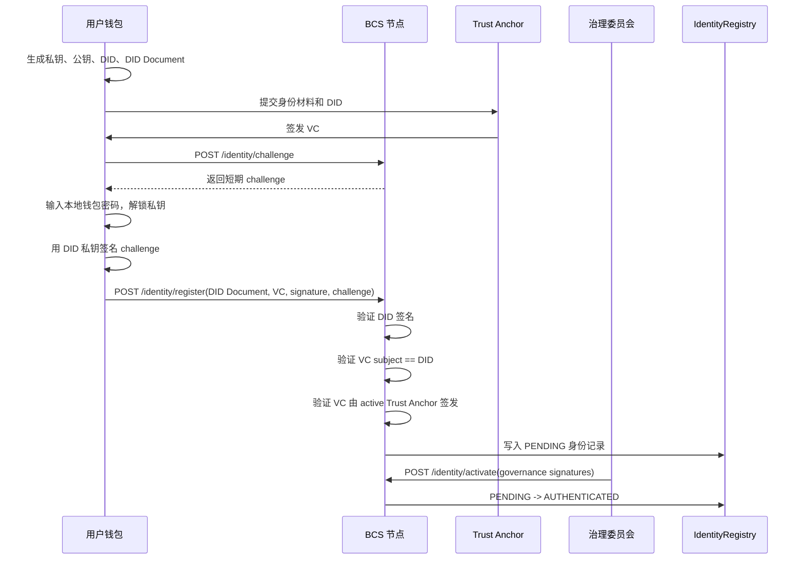

# BCS 身份认证机制设计与当前实现

> 文档类型: 身份认证机制、接口流程、治理接入方案  
> 当前状态: 已将 REST 身份注册接口从 stub 改为 DIDAuth + VC + Trust Anchor 校验路径  
> 编写日期: 2026-05-01

---

## 1. 结论

BCS 不采用“服务器保存用户密码然后登录”的传统账号体系。推荐机制是:

1. 用户本地钱包用密码、助记词、硬件密钥或 Passkey 解锁私钥。
2. 节点发放短期 DIDAuth challenge。
3. 钱包用 DID 私钥签名 challenge，表示“用户同意本次操作”。
4. 用户身份由 Trust Anchor 签发 VC 证明。
5. Trust Anchor 由创世配置或链上治理批准。
6. 身份注册先进入 `PENDING`，再由治理多签/表决激活为 `AUTHENTICATED`。

因此，密码只存在于用户本地钱包，不上传节点。节点验证的是 DID 签名、VC 签名和治理授权。

---

## 2. 当前已落地的代码能力

### 2.1 DID 控制权

代码位置:

- `bcs_chain/identity/did.py`
- `DIDManager.create_did(private_key)`
- `DIDManager.verify_ownership(did, challenge, signature, public_key)`

作用:

- 用 secp256k1 私钥生成 `did:bcs:<pubkey_hash>`。
- 通过签名 challenge 证明用户控制该 DID。

### 2.2 VC 凭证

代码位置:

- `bcs_chain/identity/vc.py`
- `VCManager.issue_credential(...)`
- `VCManager.verify_credential(vc, issuer_public_key)`

作用:

- Trust Anchor 给用户 DID 签发 `BCSIdentityCredential`。
- 节点验证 VC 签名、过期时间和撤销状态。

### 2.3 Trust Anchor

代码位置:

- `bcs_chain/identity/trust_anchor.py`
- `TrustAnchorRegistry`

作用:

- 管理允许签发 VC 的认证机构公钥。
- 当前支持添加、移除、列出和验签。
- 节点启动时可从 TOML 的 `[identity] trust_anchors` 加载启动信任锚。

### 2.4 身份注册表

代码位置:

- `bcs_chain/identity/registry.py`
- `IdentityRegistry.register(...)`
- `IdentityRegistry.verify_and_activate(...)`

作用:

- 注册 DID 后进入 `PENDING`。
- 治理激活后进入 `AUTHENTICATED`。
- 支持 `SUSPENDED` 和 `REVOKED`。

### 2.5 REST 接口

代码位置:

- `bcs_chain/api/rest_server.py`
- `bcs_chain/api/schemas.py`

当前新增/修改接口:

- `POST /api/v1/identity/challenge`
- `POST /api/v1/identity/register`
- `POST /api/v1/identity/activate`
- `GET /api/v1/identity/{did}/status`

---

## 3. 推荐认证流程



---

## 4. 接口详细说明

### 4.1 获取 DIDAuth Challenge

请求:

```http
POST /api/v1/identity/challenge
Content-Type: application/json
```

```json
{
  "did": "did:bcs:<64 hex chars>",
  "action": "identity.register"
}
```

响应:

```json
{
  "did": "did:bcs:<64 hex chars>",
  "action": "identity.register",
  "challenge": "{\"action\":\"identity.register\",\"did\":\"did:bcs:...\",\"domain\":\"bcs-chain\",\"expires_at\":...}",
  "expires_at": 1760000000,
  "signing_instructions": "Sign the UTF-8 challenge bytes with the DID private key."
}
```

钱包必须签名 `challenge` 字符串的 UTF-8 bytes。challenge 默认 5 分钟过期，且只能使用一次。

### 4.2 注册身份

请求:

```http
POST /api/v1/identity/register
Content-Type: application/json
```

```json
{
  "did_document": {
    "id": "did:bcs:<64 hex chars>",
    "controller": "did:bcs:<64 hex chars>",
    "public_keys": [
      {
        "id": "did:bcs:<64 hex chars>#keys-1",
        "type": "EcdsaSecp256k1VerificationKey2019",
        "controller": "did:bcs:<64 hex chars>",
        "public_key_hex": "04..."
      }
    ],
    "authentication": ["did:bcs:<64 hex chars>#keys-1"],
    "service_endpoints": [],
    "created": 0,
    "updated": 0
  },
  "verifiable_credential": "{...VC JSON-LD...}",
  "challenge": "{...server challenge...}",
  "signature": "<hex ECDSA signature over challenge>"
}
```

节点检查:

1. DID 格式合法。
2. DID Document controller 与 DID 一致。
3. challenge 存在、未过期、未使用、action 为 `identity.register`。
4. signature 能用 DID Document 公钥验证。
5. VC subject DID 等于注册 DID。
6. VC 未过期、未撤销。
7. VC 签名能被某个 active Trust Anchor 公钥验证。
8. IdentityRegistry 中没有重复 DID。

成功后:

- 写入 `IdentityRegistry`。
- 状态为 `PENDING`。
- 返回伪交易哈希。当前还没有真正构造链上 `REGISTER_IDENTITY` 交易。

### 4.3 治理激活身份

请求:

```http
POST /api/v1/identity/activate
Content-Type: application/json
```

```json
{
  "did": "did:bcs:<64 hex chars>",
  "gov_signatures": ["<sig1>", "<sig2>"],
  "auth_height": 100
}
```

节点检查:

1. DID 存在。
2. DID 当前状态为 `PENDING`。
3. `gov_signatures` 数量达到 `required_gov_signatures`。

成功后:

- `PENDING -> AUTHENTICATED`
- 记录 `first_auth_height`

当前限制:

- 目前治理签名还是 opaque proof，只检查数量和非空。
- 下一步应接入真实治理成员公钥和链上 validator/governance set 验签。

### 4.4 查询身份状态

请求:

```http
GET /api/v1/identity/{did}/status
```

响应:

```json
{
  "did": "did:bcs:<64 hex chars>",
  "status": 2,
  "authenticated_at_height": 100,
  "trust_anchor": "ta-founder-01"
}
```

---

## 5. Trust Anchor 接入机制

### 5.1 创世/启动接入

系统启动阶段可以在 TOML 中配置初始 Trust Anchor:

```toml
[identity]
trust_anchors = [
  {
    id = "ta-founder-01",
    name = "Founder Identity Authority",
    public_key = "04...",
    url = "https://identity.example.invalid"
  }
]
```

用途:

- 初始化网络时建立第一批可信认证机构。
- 适合创始人、项目方或初始治理委员会确认接入。

注意:

- 这只适合启动阶段。
- 网络运行后，不建议继续靠手工改配置新增认证机构。

### 5.2 后续治理接入

正式机制应为:

1. 发起 `ADD_TRUST_ANCHOR` 治理提案。
2. 提案包含 anchor id、名称、公钥、服务 URL、生效高度。
3. 治理成员投票或多签。
4. 达到阈值后上链。
5. 到达 `effective_height` 后，新 Trust Anchor 生效。

同理，移除认证机构使用 `REMOVE_TRUST_ANCHOR` 治理提案。

当前代码中 TrustAnchorRegistry 已具备添加/移除方法，但还没有完整链上治理交易闭环。

---

## 6. 与密码机制的关系

BCS 认证不建议让节点保存用户密码。推荐分层:

| 层级 | 谁验证 | 作用 |
|---|---|---|
| 钱包密码 | 用户本地钱包 | 解锁私钥 |
| DIDAuth 签名 | 节点 | 证明用户同意本次操作 |
| VC 签名 | 节点 | 证明用户身份由可信机构认证 |
| 治理多签 | 节点/链上治理 | 激活身份、接入认证机构、修改参数 |

所以“类似密码验证的同意机制”应体现为:

1. 用户本地输入密码。
2. 钱包解锁 DID 私钥。
3. 钱包签名节点 challenge。
4. 节点验证签名。

节点永远不需要知道用户密码。

---

## 7. 当前实现边界

已经落地:

- DID challenge 接口。
- 注册时 DID 签名验证。
- 注册时 VC subject 校验。
- 注册时 Trust Anchor 签名校验。
- 注册成功写入 IdentityRegistry。
- PENDING 身份治理激活接口。
- 身份状态查询读取真实 Registry。
- 节点配置加载 bootstrap Trust Anchors。

仍需后续完善:

- 真实链上 `REGISTER_IDENTITY` 交易打包，而不是返回伪 tx hash。
- Trust Anchor 新增/移除的链上治理提案。
- 治理签名的真实密码学验签。
- VC 撤销列表上链或 Merkle proof。
- DID Document 更新与密钥轮换。
- API 级 DIDAuth 中间件，保护更多高风险接口。
- 身份隐私: 链上只记录 VC hash，不公开完整 VC。

---

## 8. 推荐下一步

优先级建议:

1. 增加 Trust Anchor CLI/API 管理命令，仅限开发环境。
2. 把 `REGISTER_IDENTITY` 做成真实交易，进入 mempool 和区块。
3. 增加治理提案类型 `ADD_TRUST_ANCHOR`、`REMOVE_TRUST_ANCHOR`、`ACTIVATE_IDENTITY`。
4. 把治理签名从“数量检查”升级为“按治理成员 DID 公钥验签”。
5. 对 `MINT`、`REPLENISH`、`GOV_PARAMETER_CHANGE` 等高风险接口接入 DIDAuth challenge。

