# BCS 逆向货币离线支付系统运行流程框图

> 文档类型: 系统运行流程、业务操作流程、链上验证流程、治理流程  
> 适用项目: BCS Chain / 逆向货币离线支付系统  
> 图表格式: Mermaid Markdown  
> 编写日期: 2026-05-01

---

## 1. 系统运行总览

系统整体运行可以理解为五条主线同时协作:

1. 用户侧: 创建钱包、完成身份认证、发起交易、离线缓存、同步确认。
2. 节点侧: 接收交易、验证规则、进入 mempool、出块、提交状态。
3. 经济规则侧: 校验销售 `phi`、工资 `psi`、N 可行性和 N 生命周期。
4. 身份治理侧: DID/VC 认证、信任锚、治理多签、参数变更。
5. 外部支付侧: 现实货币/银行/现金/支付网关/发票/工资单只作为可选凭证引用，链上不处理 D 资产。
5. 网络运维侧: P2P 广播、区块同步、API 查询、监控告警。

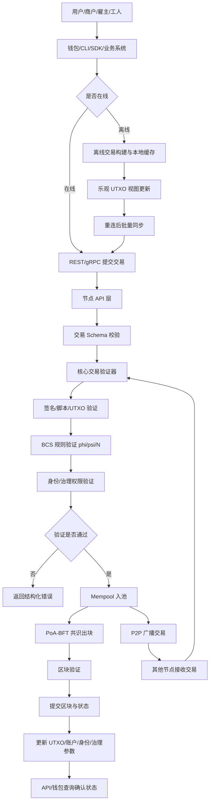

---

## 2. 节点启动与运行流程

节点启动时，需要加载配置、初始化存储、恢复链状态、启动 API、P2P 和共识任务。验证者节点会参与出块，观察者节点只同步和提供查询服务。

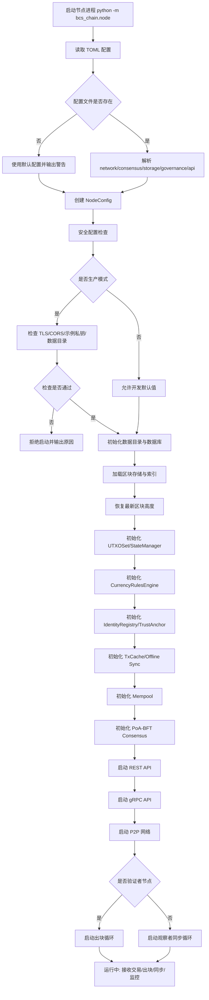

---

## 3. 身份认证流程

身份认证由 DID、VC、信任锚和链上注册交易组成。用户先在本地生成密钥和 DID，再由信任锚签发 VC，最后提交链上身份注册交易。认证成功后，用户才能获得 N 初始发放或参与特定权限交易。

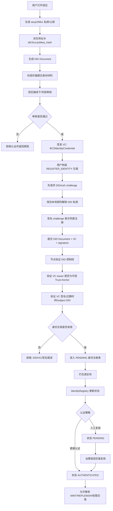

### 3.1 身份状态流转

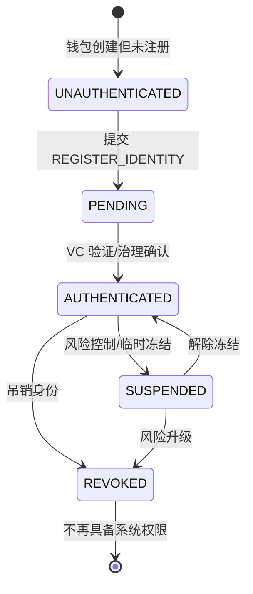

---

## 4. N 货币发放与补充流程

N 货币的 MINT 和 REPLENISH 必须受身份与治理约束。普通用户不能任意铸造 N。

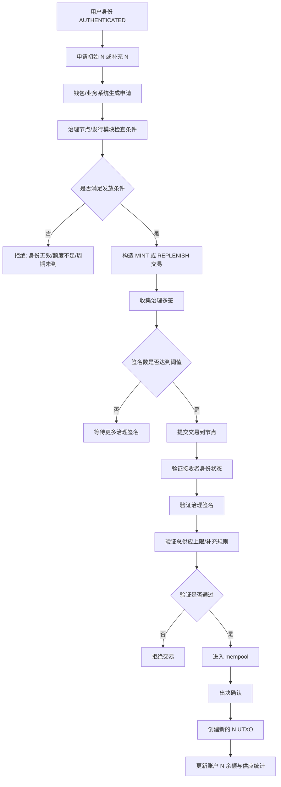

---

## 5. 治理提案与表决流程

治理用于修改系统参数、验证者集合、信任锚列表和关键权限。治理流程必须具备提案、投票、阈值判断、等待期和生效高度。

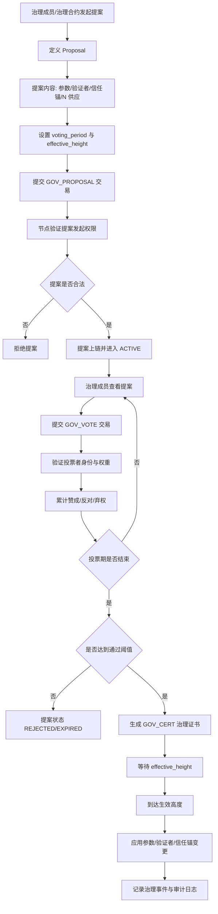

### 5.1 治理提案状态机

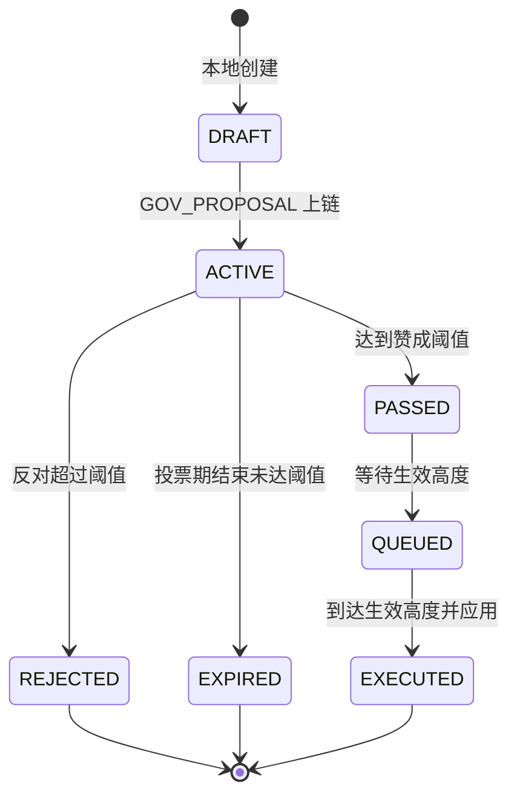

### 5.2 参数变更时序

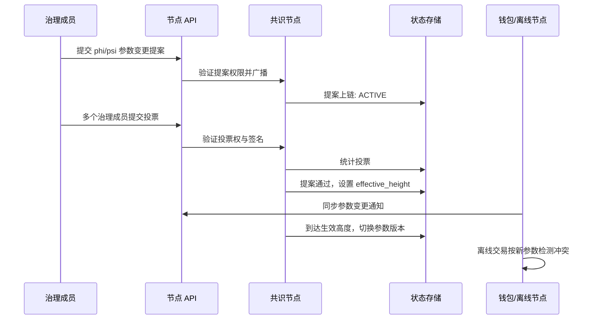

---

## 6. 在线普通 N 转账流程

普通 N 转账不涉及外部支付金额，也不触发 `phi` 或 `psi` 规则，但仍需验证 UTXO、签名、金额和手续费。

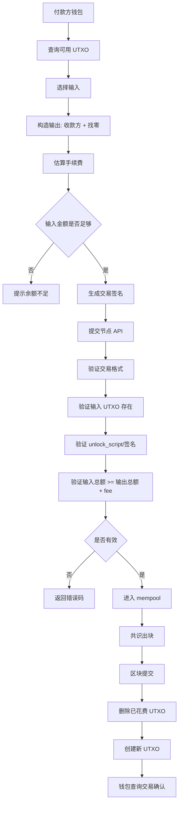

---

## 7. 销售交易流程 `TRANSFER_SALE`

销售交易是 BCS 的核心流程。买方可通过现实货币、现金、银行或支付网关完成付款；这些凭证引用是可选 metadata。链上只要求交易提供 `external_amount` 作为 `phi` 的计算基数，并结算对应 N。卖方必须按 `phi` 向买方转移 N。

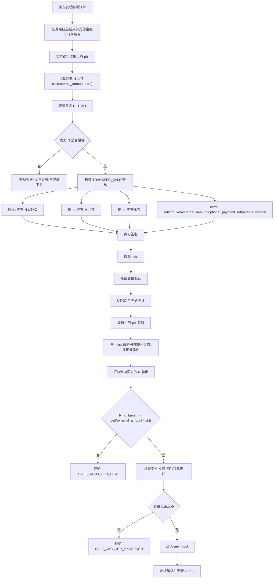

### 7.1 销售交易参与方时序

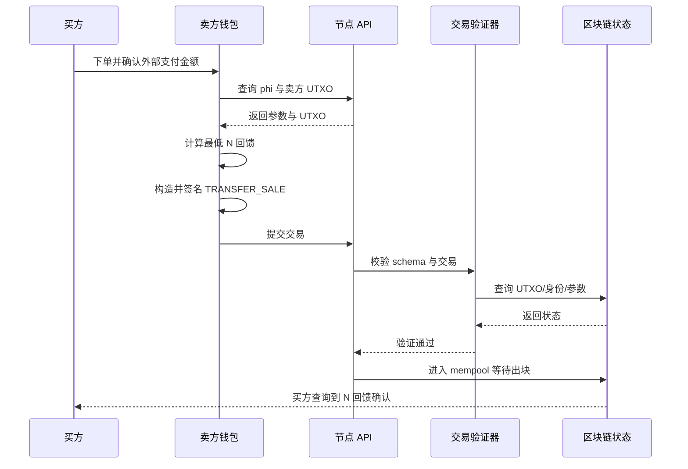

---

## 8. 工资交易流程 `TRANSFER_WAGE`

工资交易中，雇主可通过现实支付系统、银行、现金或工资单流程发薪；工资单/流水/支付网关引用是可选 metadata。链上只要求 `external_amount` 作为 `psi` 的计算基数，并结算对应 N。工人必须按 `psi` 向雇主转移 N。

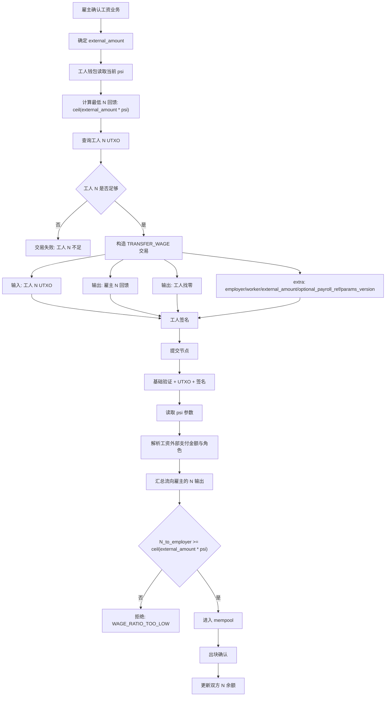

---

## 9. 离线支付创建、缓存与同步流程

离线支付是系统的重点能力。离线交易先在本地构建和缓存，重连后再同步到链上。

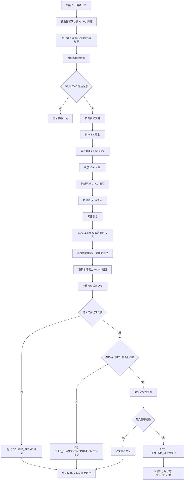

### 9.1 离线交易状态机

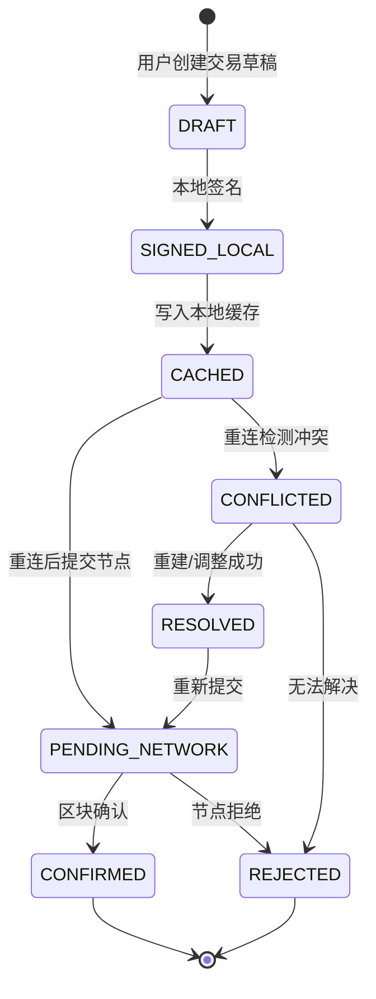

### 9.2 离线冲突处理流程

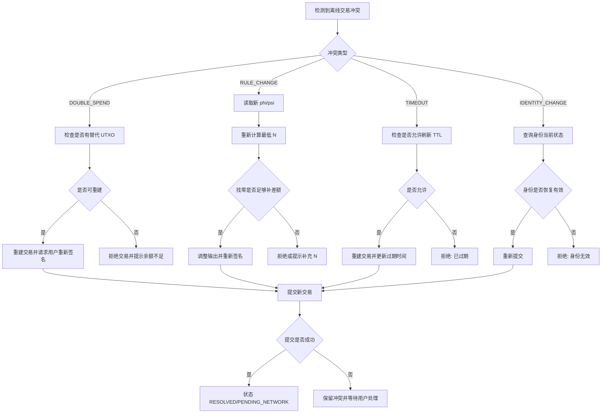

---

## 10. ZK 隐私交易流程

ZK 当前适合作为隐私扩展原型。隐私交易通过 commitment 隐藏金额，通过 nullifier 防双花，通过 proof 证明规则成立。

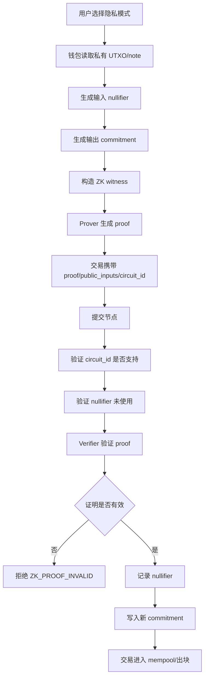

---

## 11. API 请求处理流程

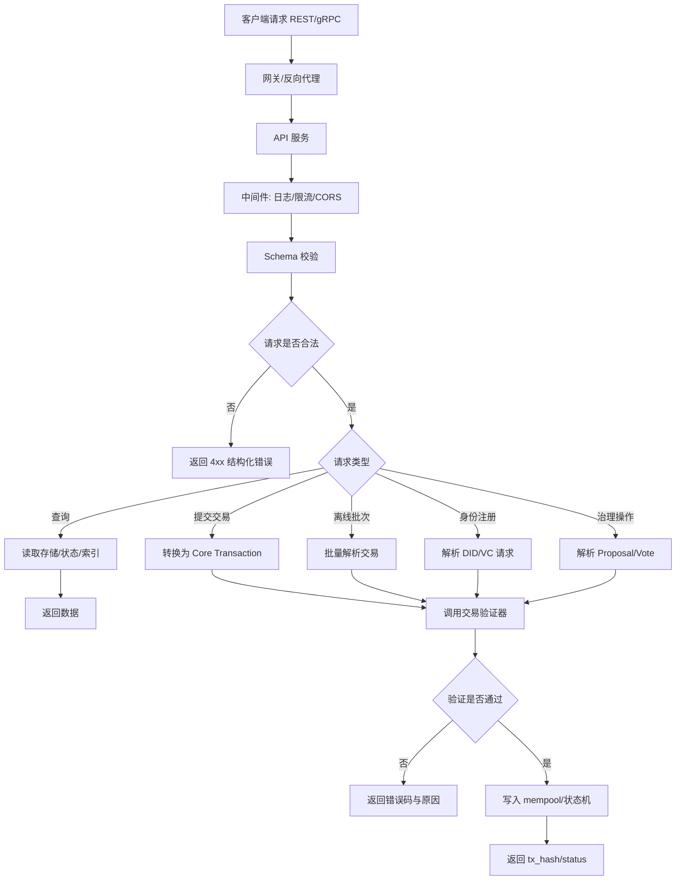

---

## 12. 实际用户使用流程

### 12.1 普通用户首次使用

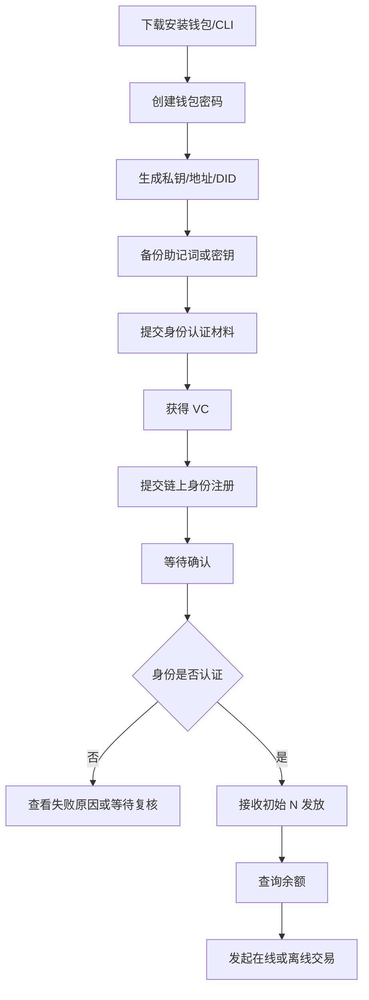

### 12.2 商户实际收款与销售

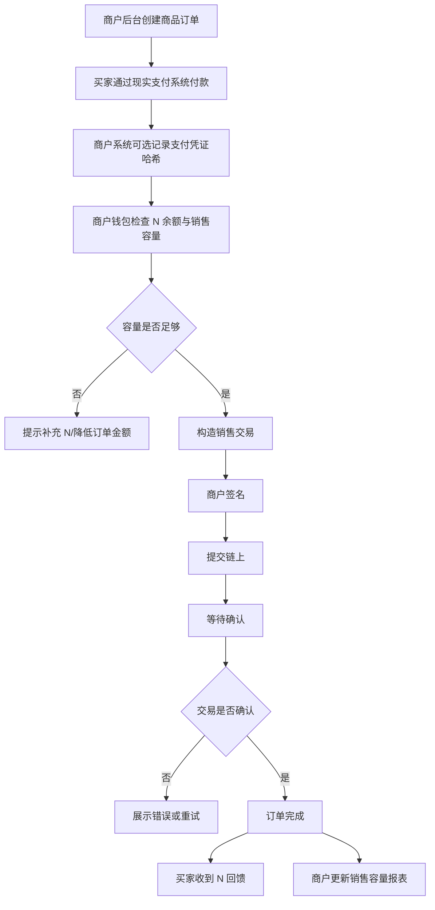

### 12.3 雇主发薪

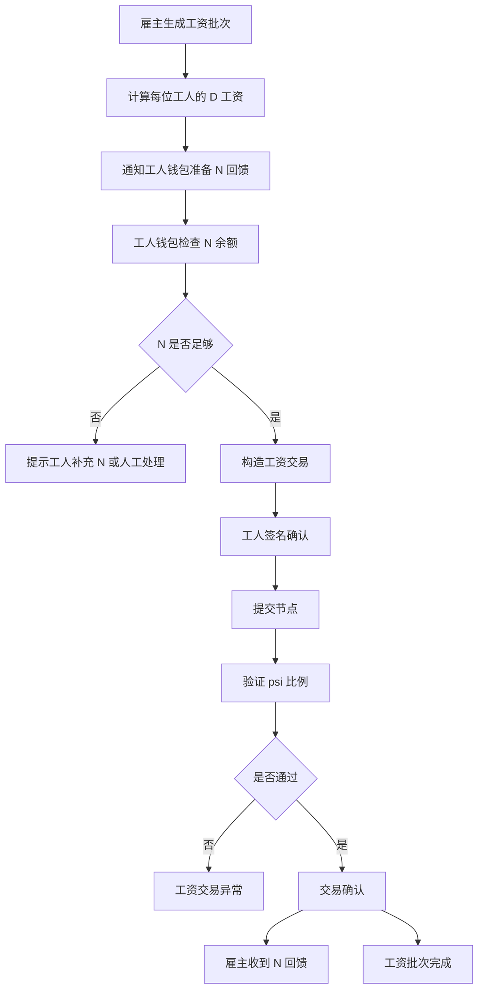

### 12.4 用户离线支付

```mermaid
flowchart TD
    A[用户无网络] --> B[打开钱包离线模式]
    B --> C[选择收款方与金额]
    C --> D[钱包基于本地 UTXO 构建交易]
    D --> E[用户签名]
    E --> F[生成离线交易文件/二维码/本地缓存]
    F --> G[收款方标记为待结算]
    G --> H[用户恢复网络]
    H --> I[钱包自动同步]
    I --> J{交易是否上链}
    J -- 是 --> K[收款方状态变为已确认]
    J -- 否 --> L[展示冲突原因]
    L --> M[重建交易/人工处理/取消]
```

---

## 13. 运维监控与故障处理流程

```mermaid
flowchart TD
    A[监控系统采集指标] --> B[区块高度/peer/mempool/API/磁盘/错误率]
    B --> C{是否触发告警}
    C -- 否 --> D[持续监控]
    C -- 是 --> E[告警通知运维]
    E --> F{故障类型}
    F -- 节点停止 --> G[检查进程/容器/日志]
    F -- 高度落后 --> H[检查 P2P/共识/数据库]
    F -- API 错误率高 --> I[检查网关/限流/异常请求]
    F -- 磁盘不足 --> J[扩容/归档/清理日志]
    F -- 验证者异常 --> K[切换/重启/治理处理]
    G --> L[恢复服务]
    H --> L
    I --> L
    J --> L
    K --> L
    L --> M[复盘并记录事件]
```

---

## 14. 系统完整闭环流程

下面的流程把身份、N 发放、交易、治理、离线和运维放到一个闭环中。

```mermaid
flowchart TD
    A[系统部署多节点网络] --> B[治理初始化参数 phi/psi/验证者/信任锚]
    B --> C[用户创建钱包与 DID]
    C --> D[信任锚签发 VC]
    D --> E[用户注册身份上链]
    E --> F[治理多签发放初始 N]
    F --> G[用户开始普通转账/销售/工资交易]
    G --> H[节点验证 UTXO/签名/身份/BCS 规则]
    H --> I[PoA-BFT 出块确认]
    I --> J[钱包与业务系统查询状态]
    J --> K{是否发生离线场景}
    K -- 是 --> L[离线缓存交易]
    L --> M[重连同步与冲突解决]
    M --> G
    K -- 否 --> N[正常在线使用]
    N --> O{是否需要治理调整}
    O -- 是 --> P[发起提案与投票]
    P --> Q[参数或验证者在指定高度生效]
    Q --> G
    O -- 否 --> R[持续运行]
    R --> S[监控/审计/备份]
    S --> T{是否发现风险}
    T -- 是 --> U[暂停/吊销/参数调整/恢复]
    U --> P
    T -- 否 --> R
```

---

## 15. 流程中的关键检查点

| 流程 | 关键检查点 | 失败处理 |
|---|---|---|
| 身份认证 | DID 控制权、VC 签名、issuer 可信、凭证未过期 | 拒绝注册，返回身份错误码 |
| N 发放 | 身份有效、治理多签、供应上限、发放周期 | 拒绝 MINT/REPLENISH |
| 普通转账 | UTXO 存在、签名有效、金额守恒 | 拒绝交易 |
| 销售交易 | `N_to_buyer >= ceil(external_amount * phi)`、销售容量足够；外部凭证引用可选 | 拒绝并提示 N 不足或比例不足 |
| 工资交易 | `N_to_employer >= ceil(external_amount * psi)`；工资单/支付引用可选 | 拒绝并提示工资规则不满足 |
| 治理投票 | 投票者权限、签名、投票期、阈值 | 提案失败或等待更多投票 |
| 离线同步 | 输入未花费、参数未变、TTL 未过期、身份有效 | 标记冲突并尝试解决 |
| ZK 交易 | proof 有效、nullifier 未使用、circuit_id 支持 | 拒绝隐私交易 |
| 运维运行 | 高度同步、peer 正常、API 健康、磁盘充足 | 告警并进入故障处理 |

---

## 16. 推荐落地顺序

实际实施时建议按以下顺序落地和验收:

1. 节点启动流程与配置加载。
2. 钱包创建、DID 创建和身份注册。
3. 治理初始化参数和信任锚。
4. MINT 初始 N 发放。
5. 普通 N 转账。
6. 销售交易 `TRANSFER_SALE`。
7. 工资交易 `TRANSFER_WAGE`。
8. 离线交易创建和缓存。
9. 重连同步和冲突解决。
10. 治理提案、投票和参数生效。
11. 多节点 P2P 同步和 PoA-BFT 出块。
12. API 网关、监控、备份和生产安全校验。
13. ZK 隐私交易实验模式。

---

## 17. 总结

BCS 系统的运行不是单一“提交交易并出块”的流程，而是身份、治理、经济规则、离线同步和节点共识共同组成的闭环。身份认证决定用户是否具备参与资格，治理决定系统参数和权限边界，交易流程只结算 N，并用 `external_amount` 计算 N 义务；现实支付凭证引用是可选审计信息。离线同步保证弱网络场景下的可用性，运维监控保证节点网络长期稳定。

在实际实现中，最重要的是把每条流程的状态、输入、输出和失败原因做成可验证、可审计、可恢复的机制。只有这样，系统才能从架构原型变成可演示、可测试、可试点运行的完整 BCS 离线支付系统。
