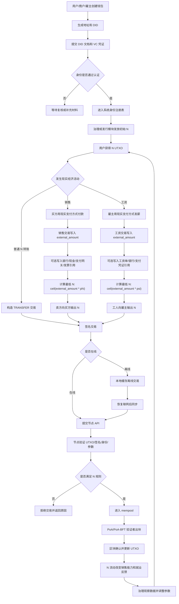

# BCS 逆向货币 N 系统

## 中文说明

### 1. 项目目的

现在很多人面临失业、年龄歧视和就业机会收缩，尤其是 35 岁以后很难再找到稳定工作。有人说“不雇佣 35 岁以上员工的公司，就不要买它们的产品”，但现实中很难执行，因为普通消费者无法把每次购买和就业责任稳定连接起来。本项目希望用 N 货币把这种关系抽象出来：你不是直接和某家公司签一份就业承诺，而是在货币规则中加入“被需要”的结算维度，让消费、销售、就业和 N 流动形成可验证的经济反馈。

这个项目不是为了让人一夜暴富，也不是为了给普通人增加负担。它只是使用了区块链和数字货币的技术形式，但和挖矿、炒币、算力竞争没有关系。它的目标是让货币重新成为更平衡的社会资源分配工具，用逆向货币 N 调节现行单向 D 货币长期积累下来的失衡，减少人被市场经济淘汰的风险，并为避免经济危机提供一种新的制度工具。

当前项目还只是一个很初级的开始。它不是最终答案，而是一个可以运行、可以讨论、可以改进的原型。就像早期比特币只是一个很小的实验，后来改变了很多人对货币和网络协作的理解一样，BCS 和 N 货币也需要更多人加入，一起把这个想法从代码、规则、治理、应用和社会理解上逐步完善。

---

### 2. 思想来源

本项目的思想来源我的Bidirectional Currency System，也就是“双向货币系统”或“逆向货币系统”的基本思想。

在人类早期的物物交换中，一次交换通常同时满足两个方向。你需要别人的东西，说明你的需求被满足；别人愿意接受你的东西，说明你也被别人需要。也就是说，需求和被需求在同一次交换中同时出现。虽然物物交换效率很低，需要双方刚好互相需要对方的东西，但它保留了一种直接的互惠关系。

后来货币出现以后，交换效率大幅提高。货币解决了物物交换中“双重巧合”的问题，让人们可以先卖出自己的劳动或商品，得到货币，再用货币购买别人的商品。货币让分工、储蓄、价格、市场和长期契约成为可能，这是人类社会的重要发明。

但货币也带来了一个结构性变化：购买时，买方的需求被满足了，但买方自身是否被别人需要，并不会在同一笔交易中自动得到确认。现代社会中，一个人是否“被需要”，主要通过就业、工资、订单、职位和收入来体现。只要能找到工作、能卖出劳动或产品，这个问题不明显；但如果工业化、自动化、平台化和资本集中不断发展，越来越多的人可能消费能力不足、就业机会不足、议价能力下降，那么“被需要”这一侧就会逐渐丢失。

现行单向 D 货币的核心问题不在于它没有价值，而在于它只很好地表达了“需求”和“购买力”，却没有在货币结算中直接表达“被需要”。在工业化早期，商品不够多，劳动力需求旺盛，这个缺点不明显。随着生产能力越来越强，商品越来越多，自动化越来越强，单向货币系统会越来越容易出现一个矛盾：社会有能力生产很多东西，但很多人因为没有工作或收入不足，无法参与消费；企业为了利润继续降低用工，进一步削弱社会总需求。

BCS 的出发点就是补上这个缺失的方向。D 仍然代表现实货币、价格和支付；N 则代表“被需要”的结算资产。销售和工资不再只是 D 的单向流动，而是同时触发 N 的反向流动。这样，市场不是被取消，而是被增加了一个新的反馈维度。

---

### 3. 这个项目是什么，不是什么

这个项目是一个逆向货币 N 的技术原型。它使用区块链、UTXO、身份认证、治理、多节点同步、离线交易和可选隐私证明等技术，来验证 BCS 货币规则是否可以被工程化实现。

它不是普通公链项目。它不追求开放挖矿，不依赖 PoW 算力竞争，不鼓励投机炒作，也不把“币价上涨”作为主要目标。它的重点不是制造一个新的投机资产，而是建立一个可以表达“需求”和“被需求”双向关系的结算系统。

它不是直接替代现实货币。当前阶段，现实货币、银行、现金、支付网关、发票和工资单仍然按原来的方式存在。项目链上主要处理 N 货币。D 不强制上链，不强制接入银行或支付接口，而是先用 `external_amount` 表示外部现实金额，作为计算 N 流动的依据。外部支付凭证可以作为可选引用保存，后续如果发展需要，可以再接入银行、支付网关、发票系统、工资系统、oracle 或链上 D 资产。

它也不是一个保证任何人马上获得工作的系统。N 货币不能凭空创造岗位，也不能替代现实企业经营。它要做的是让“谁创造就业、谁提供被需要机会、谁消耗社会需求”这些关系进入可计算、可审计、可治理的货币流动中，形成长期调节力量。

---

### 4. 核心概念

#### 4.1 D：需求货币

D 可以理解为现实中的普通货币或普通支付金额。它可以来自现金、银行转账、银行卡、微信、支付宝、Stripe、发票、工资单或其他现实支付系统。

在当前项目里，D 不作为链上资产强制发行。系统不托管用户的现实资金，不处理法币充值提现，不做银行清算，不强制接入支付网关。链上只需要知道一个外部金额 `external_amount`，用它计算对应的 N 流动。

#### 4.2 N：被需要货币

N 是本项目真正处理的链上货币。它表达的是经济关系中的“被需要”维度。N 可以被发放、转移、销毁、补充和审计。

在销售中，商家获得现实支付金额后，需要向买家回馈一定比例的 N。这个规则表达：商家从消费者需求中获得收入，也要释放一部分“被需要”能力给消费者。

在工资中，雇主支付现实工资后，工人需要向雇主转移一定比例的 N。这个规则表达：雇主提供了工作机会，帮助工人获得现实收入，因此雇主获得一部分 N，用来支撑它未来的销售能力。

#### 4.3 phi 和 psi

`phi` 是销售规则参数。它决定销售外部金额需要对应多少 N 回馈给买家。

```text
N_to_buyer >= ceil(external_amount * phi)
```

`psi` 是工资规则参数。它决定工资外部金额需要对应多少 N 转移给雇主。

```text
N_to_employer >= ceil(external_amount * psi)
```

这两个参数不是随便写死的。它们应该由系统治理决定，并根据试点效果、就业情况、N 流动情况、商户压力、用户接受度和经济稳定目标逐步调整。

#### 4.4 身份认证

系统需要知道谁是用户、谁是商户、谁是雇主、谁是治理者。当前方案使用 DID 和 VC。用户先生成 DID，由信任锚或治理认可机构签发 VC，再提交链上注册。身份通过后，用户才能参与某些关键流程，例如接收初始 N、参与治理或进行高权限交易。

#### 4.5 治理

前期系统由创始人和合伙人共同表决治理。这样做是为了快速试错、避免早期规则被恶意利用，也方便修复系统问题。随着网络逐步成熟，治理权应逐步移交给整个系统，让用户、节点、商户、雇主和其他参与者通过规则参与表决。

治理不只是投票。治理要决定参数、信任锚、身份认证策略、N 发放规则、补充规则、验证者集合、升级计划和风险处置。

---

### 5. 项目整体运行流程图



---

### 6. 流程文字说明

#### 6.1 身份进入系统

用户第一次进入系统时，不是先去挖矿，也不是先购买投机资产，而是创建钱包、生成密钥和 DID。DID 是用户在系统中的去中心化身份标识。随后，用户需要通过信任锚或治理认可机构获得 VC 凭证，证明自己是合法参与者。

节点收到身份注册请求后，会验证 DID 控制权、VC 签名、issuer 是否可信、凭证是否过期，以及注册请求是否符合治理规则。通过后，身份进入系统注册表。身份状态会影响后续 N 发放、交易权限和治理资格。

#### 6.2 初始 N 发放

N 不是通过挖矿获得。前期可以由治理或发行模块根据身份认证结果进行初始发放。发放规则需要透明，例如每个通过认证的用户获得一定初始 N，或者根据试点规则给商户、工人、雇主分配不同额度。

这一步的核心是公平和可审计。系统要记录谁获得了 N、在什么高度获得、数量是多少、由哪些治理签名确认、是否有发放上限。这样可以避免 N 一开始就被少数人随意控制。

#### 6.3 普通 N 转账

普通 N 转账类似普通数字货币转账。用户选择 UTXO，填写收款地址和金额，签名后提交节点。节点验证输入是否存在、是否未花费、签名是否正确、输出金额是否合理，然后把交易放入 mempool，等待出块确认。

普通 N 转账不涉及外部支付金额，也不涉及 `phi` 或 `psi`。

#### 6.4 销售交易

销售交易是系统最重要的流程之一。现实中，买方可以使用现金、银行、微信、支付宝、支付网关或其他方式向商户付款。链上不强制处理这笔现实支付，也不强制接入支付网关。

链上销售交易至少需要写入 `external_amount`，也就是现实销售金额的计算基数。商户可以选择附带订单号、发票哈希、银行流水、支付网关订单号或其他凭证引用，但这些是可选字段。

节点验证销售交易时，会读取当前 `phi`，计算最低 N 回馈。如果商户给买方的 N 输出不足，交易会被拒绝。如果 N 足够，交易可以进入 mempool 并等待确认。

销售规则的意义在于：商户不能只从社会需求中获得 D 收入，也要付出一部分 N。商户销售规模越大，对 N 的需求越大。这样，N 就成为限制无限扩张、连接消费和就业的一种经济约束。

#### 6.5 工资交易

工资交易是另一条关键回路。现实中，雇主通过现金、银行、工资单或支付系统向工人发工资。链上不强制处理工资支付本身，也不强制保存工资单。

链上工资交易至少需要写入 `external_amount`，也就是工资金额的计算基数。工人向雇主转移一定比例的 N，比例由 `psi` 决定。工资单、银行流水和支付凭证可以作为可选引用。

工资规则的意义在于：提供就业机会的雇主可以获得 N，而 N 又能支撑未来销售能力。这样，雇佣劳动不只是企业的成本，也成为企业获得 N 的渠道之一。系统希望用这种方式把“提供工作”重新变成企业长期发展的重要条件。

#### 6.6 离线交易

项目设计了离线支付能力。用户在短时间断网时，可以基于最近同步的 UTXO 快照构造交易、本地签名并缓存。恢复联网后，钱包会把交易提交给节点。

离线交易可能遇到冲突，例如同一个 UTXO 已经被别的交易花费，或者离线期间 `phi`、`psi` 参数发生变化。系统需要识别冲突，尝试重建交易、重新计算 N、提示用户补签，或者明确拒绝。

离线能力很重要，因为现实支付并不总是在网络稳定环境中发生。一个面向普通人的货币系统，不能只适合高质量网络和专业用户。

#### 6.7 节点验证和出块

节点收到交易后，会进行多层验证。第一层是交易结构，检查版本、输入、输出、金额、序列化格式。第二层是 UTXO 和签名，检查输入是否存在、是否未花费、签名是否满足锁定脚本。第三层是身份，检查相关用户是否已认证或是否被暂停。第四层是 BCS 规则，检查销售和工资交易是否满足 N 比例。第五层是治理参数，检查当前高度对应的 `phi`、`psi` 和其他规则。

通过验证的交易进入 mempool。验证者节点使用 PoA 或 PoA-BFT 出块。这个系统不挖矿，不消耗大量算力。验证者由治理授权，前期可以由创始人和合伙人共同维护，后期逐步开放给系统治理决定。

#### 6.8 治理闭环

系统不是一次写死规则。治理者需要观察 N 流通、销售容量、就业反馈、用户体验、商户压力、交易失败原因、离线冲突、身份滥用和外部支付接入需求。

如果 `phi` 太高，商户压力可能过大，交易失败率可能上升。如果 `phi` 太低，N 对销售规模的约束可能不足。如果 `psi` 太高，工人负担可能过重；如果 `psi` 太低，雇主通过就业获得 N 的能力可能不足。治理的任务就是在这些目标之间寻找动态平衡。

---

### 7. N 和 D 的关系

本项目当前阶段主要处理 N。

D 不是强制链上资产。D 可以是现实货币，也可以是银行支付、现金支付、支付网关、发票金额、工资单金额或其他现实经济金额。链上交易用 `external_amount` 表示 D 侧金额，用来计算 N 的比例流动。

外部支付引用是可选的。也就是说，销售或工资交易可以只写入金额和参与方，也可以附带银行流水、发票、工资单或支付网关凭证。是否强制凭证，不应该在早期系统里一开始就写死。更合理的方式是：MVP 阶段先降低接入门槛，允许手动声明和可选引用；试点阶段增加凭证哈希、商户签名或信任锚验证；成熟阶段再根据需要接入支付网关、银行 API、发票系统、工资系统或 oracle。

这样做有几个好处。

第一，用户更容易理解。现实支付照常进行，BCS 钱包只负责 N 的流动。

第二，工程更容易落地。系统不需要一开始就解决银行接入、法币清算、支付牌照和稳定币托管问题。

第三，合规压力更小。项目先作为 N 规则账本和身份治理系统运行，不直接托管现实资金。

第四，后续扩展空间更大。等实际需求明确后，再决定是否强制某些行业提供凭证，或者是否引入链上 D。

---

### 8. 为什么这可能缓解就业和危机问题

现行市场经济中，企业追求利润最大化。如果技术进步能用更少人生产更多商品，企业会倾向于减少用工。短期看，企业成本下降、利润上升；长期看，如果很多人失去收入，社会总需求就会下降。商品越来越多，但有购买力的人越来越少，经济就会出现需求不足、产能过剩、失业和危机。

传统政策通常用财政刺激、货币宽松、补贴、转移支付、公共工程或就业扶持来修正这些问题。这些政策有作用，但往往依赖政府判断、预算能力、政治共识和执行效率，也可能造成资产泡沫、债务积累或资源错配。

N 货币的想法是把调节机制放进交易规则本身。商家销售越多，就越需要 N；雇主提供工作，就能通过工资规则获得 N。消费者购买商品时获得 N，工人获得工资时付出 N，企业通过雇佣和市场获得 N，再用 N 支撑销售。这样，消费、就业和销售之间不再完全断开。

这不是反市场，而是给市场补上一个反馈环。市场仍然可以定价、竞争、创新和分工，但不能完全忽视“谁在提供就业机会、谁在维持大众收入、谁在消耗社会购买力”这些问题。

如果这个机制运行良好，它可能形成一种自动稳定器。当企业大量销售却不提供足够就业或不获得足够 N 时，销售能力会受到约束；当企业提供更多就业时，可以获得更多 N，从而拥有更大的销售空间。这种规则有可能减少极端集中、降低需求断裂风险，并缓解经济危机的形成条件。

---

### 9. 技术运行方式

当前项目使用 Python 实现，核心目录是 `bcs_chain/`。系统包括以下模块：

| 模块 | 作用 |
|---|---|
| `core/` | 交易、区块、UTXO、脚本、验证器、mempool、状态 |
| `currency/` | N 货币规则、`phi/psi`、N 生命周期、可行性检查 |
| `identity/` | DID、VC、身份注册、信任锚、权限认证 |
| `offline/` | 离线交易缓存、同步、冲突解决、轻客户端视图 |
| `wallet/` | 钱包、交易构建、离线模式、导入导出 |
| `api/` | REST 和 gRPC 接口 |
| `network/` | P2P 节点、消息广播、peer 管理 |
| `consensus/` | PoA/PoA-BFT 验证者共识 |
| `zk/` | 可选零知识证明原型 |
| `simulation/` | 经济仿真和压力测试 |

系统的基本数据结构采用 UTXO 模型。N 作为链上资产存在于 UTXO 中。交易花费旧 UTXO，创建新 UTXO。这样做有利于离线支付、双花检测和并行验证。

共识层采用授权验证者方式。它不需要矿工通过算力竞争来决定出块权，而是由治理认可的验证者节点出块和签名。这更适合当前项目的目标，因为 BCS 是一个规则治理型经济系统，不是匿名算力竞赛系统。

身份层使用 DID 和 VC。DID 证明用户控制某个身份，VC 证明用户被某个信任锚认证。信任锚可以是创始团队、合作机构、治理委员会或后续系统表决认可的认证方。

---

### 10. 前期治理和后期治理

前期治理建议由创始人和合伙人共同表决决定。原因很现实：早期系统规则还不稳定，参数还需要试错，安全问题还需要快速修复，用户规模也不足以支撑完全开放治理。如果一开始就完全开放，很容易被投机者、攻击者或短期利益绑架。

前期治理应该负责：

- 确认初始验证者节点。
- 确认信任锚名单。
- 决定初始 `phi` 和 `psi`。
- 决定初始 N 发放规则。
- 处理身份认证争议。
- 修复协议和代码漏洞。
- 决定试点范围。
- 判断是否接入外部支付凭证验证。

但前期治理不能永久垄断系统。随着系统稳定，治理权应逐步移交给整个系统。后期可以采用更开放的表决治理，例如用户代表、商户代表、验证者、开发者、N 持有者、就业贡献方和其他角色共同参与。

治理移交可以分阶段：

1. 创始人和合伙人多签治理。
2. 加入早期节点和试点商户共同治理。
3. 建立正式提案和投票流程。
4. 把参数变更、信任锚变更、验证者变更逐步交给系统投票。
5. 形成透明的链上治理记录。

治理的最终目标不是让某个团队控制系统，而是让系统有能力长期自我修正。

---

### 11. 当前阶段和路线图

当前项目处于早期原型阶段。它已经有比较完整的代码骨架和文档，包括交易、区块、UTXO、身份、货币规则、离线同步、API、钱包、Docker、ZK 原型和仿真模块。但这不代表它已经可以直接生产上线。

下一阶段应重点完成：

1. 稳定交易格式和 `extra` schema。
2. 完成 DID/VC 身份注册的端到端流程。
3. 完善 N 初始发放和补充规则。
4. 完善销售和工资交易构建器。
5. 完善节点间同步和出块流程。
6. 增加更多测试，尤其是离线冲突和参数变更测试。
7. 建立清晰的治理提案和多签流程。
8. 做一个小规模试点网络。
9. 通过仿真观察 `phi/psi` 对就业、销售和 N 流动的影响。
10. 决定是否、何时、如何接入外部支付凭证验证。

更长期路线可以分为四步：

```text
阶段 1: N-only MVP，链上只处理 N，D 侧只用 external_amount
阶段 2: 可选外部凭证验证，接入发票、工资单、支付凭证哈希
阶段 3: 试点治理网络，引入更多节点和参与者表决
阶段 4: 根据实际发展决定是否接入银行、支付网关、oracle 或链上 D
```

---

### 12. 对参与者的意义

对普通用户来说，N 货币希望让消费不再只是单向花钱。用户购买商品时，能够通过规则获得 N。N 不只是奖励积分，而是和商家销售能力、系统治理和经济反馈相关的资产。

对劳动者来说，系统希望让“被雇佣、被需要、提供劳动”不再只是被动接受工资，而是进入更大的货币反馈结构。劳动关系会通过 N 影响企业未来销售能力。

对商户和企业来说，N 不是惩罚，而是一种新的经营约束。企业如果想扩大销售，需要管理自己的 N 来源。提供就业、参与系统、获得用户信任、从市场获得 N，都会成为经营的一部分。

对治理者来说，N 是一个调节工具。它不是简单发钱，也不是简单征税，而是通过交易规则改变市场反馈。

对开发者来说，这个项目是一个结合货币理论、区块链工程、身份系统、离线支付和治理机制的开放实验。

---

### 13. 风险和限制

这个项目有很多不确定性。

第一，经济模型需要试验。`phi` 和 `psi` 设置不当，可能导致商户压力过大、工人负担过重、N 流动不足或投机行为。

第二，外部支付真实性在 MVP 阶段不能完全由链上证明。因为现实货币、银行、现金、支付网关、发票和工资单都是链外系统。当前方案把它们作为可选引用，后续需要根据业务需求逐步增加验证。

第三，身份认证需要谨慎。过严会阻碍用户进入，过松会导致滥用和虚假交易。

第四，治理可能被少数人控制。前期创始团队治理是为了启动系统，但后期必须逐步透明化和系统化。

第五，技术实现还很早期。代码中仍有原型、简化实现和需要安全审计的部分。不能把当前版本当成生产级金融系统直接使用。

第六，社会理解需要时间。N 货币不是传统积分，也不是普通代币。它代表一种新的经济反馈规则，需要通过文档、演示、试点和真实数据逐步建立共识。

---

### 14. 如何加入

这个项目需要很多方向的参与者：

- 货币理论和经济模型研究者。
- 区块链底层开发者。
- Python 后端开发者。
- 钱包和前端开发者。
- DID/VC 身份系统开发者。
- 密码学和 ZK 研究者。
- 仿真和数据分析人员。
- 商户、雇主和试点组织。
- 关注就业、年龄歧视、经济危机和社会资源分配的人。

如果你认同一个基本判断：货币不只是支付工具，也是社会资源分配工具；现行单向 D 货币在工业化和自动化之后逐渐暴露结构性缺点；那么 N 货币和 BCS 可能值得一起探索。

这个项目不承诺马上成功，但它提出了一个可以工程化、可以治理、可以试点、可以被反驳也可以被改进的方向。

---

